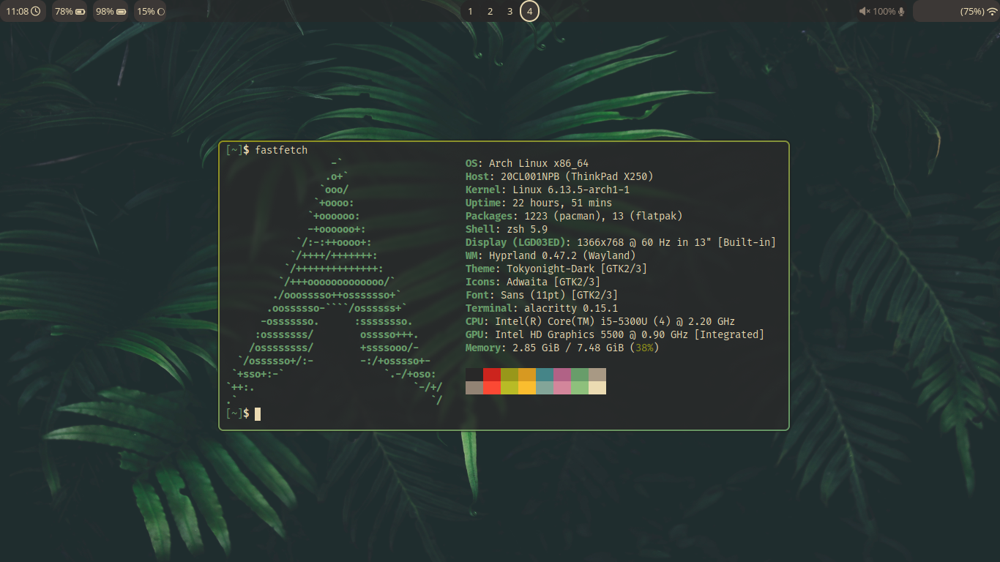
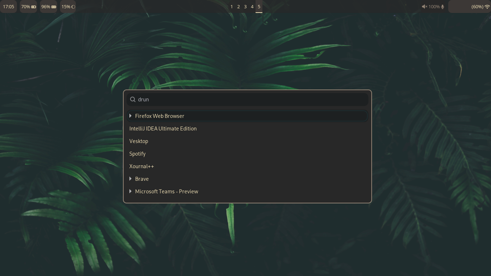
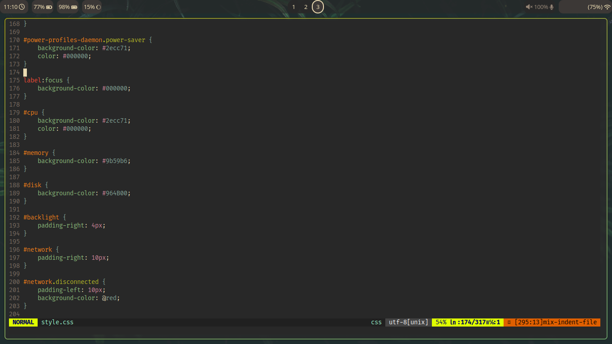

# thinkpad dotfiles

## Dependencies
- Hyprland
- Waybar
- Wofi
- Alacritty
- Dunst
- Neovim
- swaybg (tool for setting wallpaper)

## Fonts
I'm using **FontAwesome** for some of my configurations. This makes me able to display icons on the status bar.
