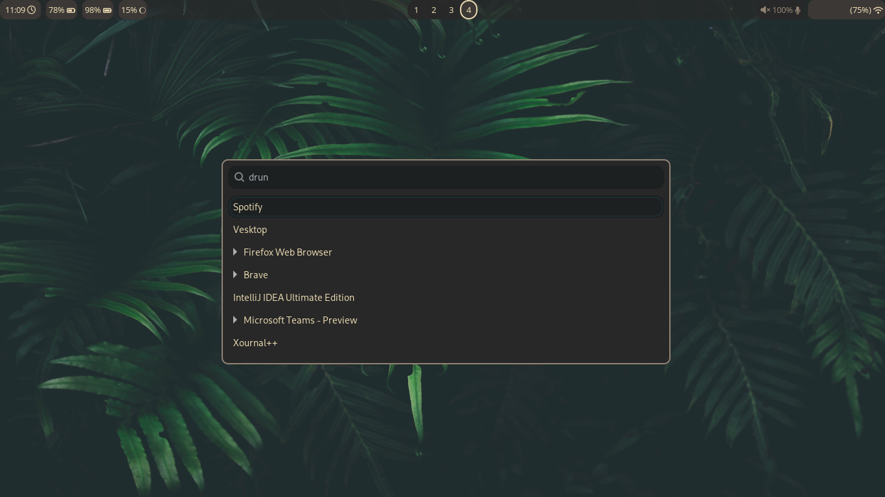

# thinkpad dotfiles
## Screenshots

## Dependencies
- Hyprland
- Waybar
- Wofi
- Alacritty
- Dunst
- Neovim
- swaybg (tool for setting wallpaper on Wayland)
- [Oh My Zsh](https://github.com/ohmyzsh/ohmyzsh)

## Fonts
I'm using **FontAwesome** for some of my configurations. This makes me able to display icons on the status bar.

## Acknowledgements
I'm using/taking inspiration from these repositories:
- [wofi themes](https://github.com/joao-vitor-sr/wofi-themes-collection)
- [alacritty themes](https://github.com/alacritty/alacritty-theme)
